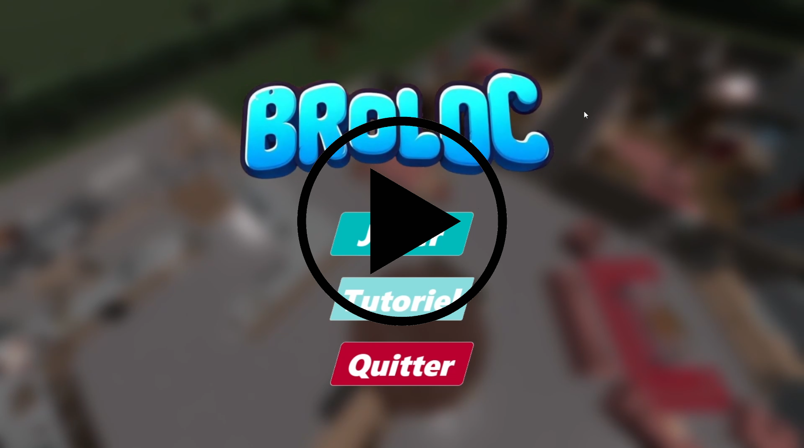

  # Hi, I'm Alexis CHAVY! 👋
  
  **Software Engineering Student @ TELECOM Nancy & UQAC**
   
  *Specialized in System Programming, Real-Time Engines & C/C++*

  
  

 

## 🚀 Current Status: Open for Opportunities

> 🎯 **Looking for:** 6-month End-of-Studies Internship (Ingénieur Logiciel / R&D)
> 📅 **Start Date:** July 2025 or after
> 🌍 **Location:** France, Canada (Quebec), or Abroad.

---

## 🛠️ Technical Arsenal

I focus on **low-level optimization**, **architecture**, and building robust **tools**.

| Core Languages | Systems & Tools | Concepts |
| :--- | :--- | :--- |
|        |        | **Memory Management**   **Parsing & Compilation**   **Parallel Computing (MPI/OpenMP)**   **Software Architecture** |

---

## 🏆 Featured Projects

### 1. Python to Assembly Compiler
**Stack:** `C++` `Assembly x86` `Parsing` `Memory Management`

> **The Challenge:** Building a compiler from scratch to translate a subset of Python into executable Assembly code.
> * Designed the Lexer and Parser for syntax analysis.
> * Managed symbol tables and manual memory allocation.
> * Optimized code generation for x86 architecture.

---

### 2. Custom 2.5D Rendering Engine
**Stack:** `C` `SDL2` `Maths` `No Game Engine`

> **The Challenge:** Creating a pseudo-3D racing game (Retro style) without using any existing game engine like Unity or Unreal.
> * Implemented **Rasterization/Raycasting** techniques for 2.5D rendering.
> * Handled the main loop, event polling, and texture mapping manually.
> * Pure C memory management (malloc/free) for dynamic entities.

---

### 3. Modular RPG Architecture
**Stack:** `Java` `Design Patterns` `Clean Code`

> **The Challenge:** Designing a scalable text-based RPG focusing purely on software architecture quality.
> * Strict implementation of **SOLID principles**.
> * Heavy use of patterns: **Factory** (Entities), **Strategy** (Combat), **Observer** (Events) among others.
> * Result: A codebase that allows adding new features without breaking existing logic.

---

### 4. AI Agents & Legacy Code Research
**Stack:** `Java` `AI Research` `Refactoring` `Legacy Code`

> **The Challenge:** Improving decision predictability of autonomous agents (OAMDP) within an existing, complex academic codebase.
> * Analyzed and refactored **Legacy Code** to implement new features.
> * Ran experimental protocols to measure agent efficiency in constrained environments.
> * Produced a technical research paper detailing the findings.

---

### 5. Unreal Engine 5 Real-Time Simulation
**Stack:** `UE5` `C++` `Blueprints` `Multiplayer`

> **The Challenge: Developing a fully functional 4-player split-screen game.
> * Gameplay Programming: Implemented the complete Game Loop, including character movement and actions, score system and UI binding.
> * Level Design & Physics: Designed a complete map with integrated collision logic and environmental interactions.
> * UX/UI: Created **dynamic interfaces** (HUD) and intuitive visual cues to guide players toward objectives.

<h3><strong> Watch the Gameplay Demo </strong></h3>

  

---

  
  ### 📫 Let's Connect!
  
  I am currently interviewing for internships. Feel free to reach out if you deal with **Industrial Modernization**, **System Programming**, or **Game Tech**.

  [**Contact Me on LinkedIn**](https://www.linkedin.com/in/alexis-chavy)

